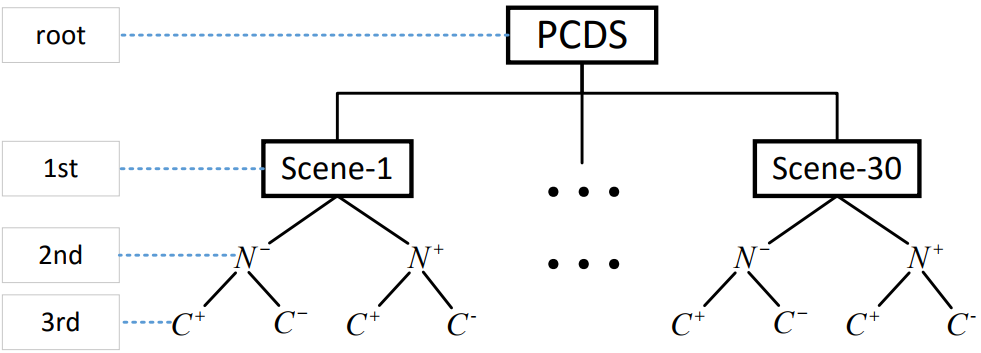
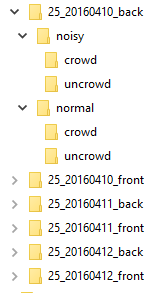
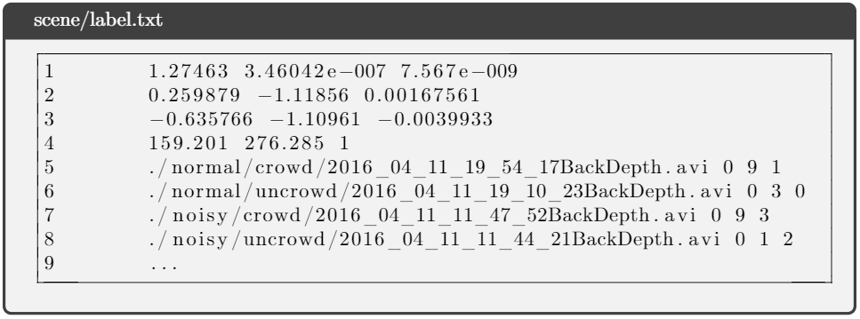
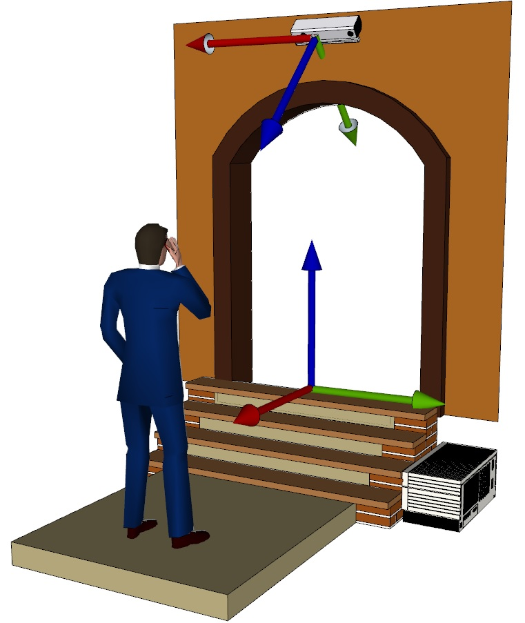

# People Counting Dataset (PCDS)
The purpose of people counting dataset is to count the number of people passing through a specified scene. In this dataset, we published a set of videos recorded in the entrance of bus scene by Kinect V1 camera. Each depth video has its corresponding RGB video. And each pair of videos is labeled to indicate the number of pedestrians passing through the scene.

- This dataset contains 5,464 pair of videos, including depth video, and color video. And total up to 10,908 videos.
- Total up to about 20,908 people passing through the scene
- These videos is recorded in the entrance of buses.
- The camera is mounted at the top of the entrance of buses.

# Dataset
The dataset is available at [BaiYun](https://pan.baidu.com/s/10O2JJrTC3WJJvweW8XGWVA?pwd=2s31) [keys: 2s31] OR [~Google Drive~ has been removed for the space limit](https://drive.google.com/drive/folders/1EK_Nfsjudn-Ku0-Q81c454fLBAQnRp-R?usp=sharing).

## Classfication
These videos are categoried by 4 sub-categories: N+C+, N+C-, N-C+, N-C-, according to the sunlight and crowed, as shown in the following table.

|          |  N+C+  |  N+C-  | N-C+ | N-C- |
|:--------:|:------:|:------:|:----:|:----:|
| sunlight | strong | strong | weak | weak |
| crowed   |   yes  |   no   |  yes |  no  |

There are total up to 5,464 videos in this dataset. The detail number of people entering and exiting the bus in each category can be referred from the following table.

|          | N+C+ | N+C- |  N-C+ | N-C- |
|:--------:|:----:|:----:|:-----:|:----:|
| entering |  937 |  616 |  5427 | 2704 |
| exiting  | 1149 |  668 |  6647 | 2760 |
| total    | 2086 | 1284 | 12074 | 5464 |


## Demo
### N-C+
[](https://www.youtube.com/watch?v=vMqTqwWLvQU)
[](https://www.youtube.com/watch?v=MnQMQ9FriAA)

### N-C-
[](https://www.youtube.com/watch?v=CcpRFchOqu4)
[](https://www.youtube.com/watch?v=AVvS_lJ5l8s)

### N+C+
[](https://www.youtube.com/watch?v=m_ybcc_qZp8)
[](https://www.youtube.com/watch?v=lcDs5B8oWKs)

### N+C-
[](https://www.youtube.com/watch?v=Ic-VTrnBdfw)
[](https://www.youtube.com/watch?v=GyRAGWO97oY)

## Dataset Structure
The structure of these videos is illustrated in the following figure.


There are 30 scene in the PCDS. And each scene is named by the the following format:

> BUS_DATETIME_\[front, back\]

where, BUS is the bus number, DATETIME is the reocred date, \[front, back\] indicates wheter the video is recorded in front entrance of the bus or not. For example the scene name 25_20160411_front means we record the video at the front door of 25 bus at 04, Nov. 2016.

The following figure shows the folder structure of the PCDS.



## Label Format
In each scene directory (i.e. 25_2016_0410_back), there is a label file which is named as "label.txt". This label file contains both camera extrinsic parameters and the number of people entering/exiting the bus for each video.
The following figure illustrate the demo of label file.


The first 4 lines is the camera extrinsic parameter, which is 4x3 matrix. The followed lines are the number of people passing through the scene whose format is shown as follows:
 > DepthVideoName,  EnteringNumber, ExitingNumber, VideoType

 DepthVideoName: the depth video name
 EnteringNumber: the number of people entering the bus
 ExitingNumber: the number of people exiting the bus
 VideoType: the video type. There are 4 video types represented by the index (0: N-C-, 1: N-C+, 2: N+C-, 3: N+C+).


# Recording Condition
These videos are recorded by Kinect V1, the configuration of camera is illustrated in the following.

The camera in mounted in the top of the entrance and has a pitch angle. People passes through the bus door. The task is to count these pedestrian (entering or existing)

# Notice
We only focus on the deth video and the color video is an accessory. We cannot guarantee the synchronization of color video and depth video.

## Citation
If you use this dataset, it is necessary to cite the following paper:

```
@article{sun2019benchmark,
  title={Benchmark data and method for real-time people counting in cluttered scenes using depth sensors},
  author={Sun, ShiJie and Akhtar, Naveed and Song, HuanSheng and Zhang, ChaoYang and Li, JianXin and Mian, Ajmal},
  journal={IEEE Transactions on Intelligent Transportation Systems},
  year={2019},
  publisher={IEEE}
}
```


## License
The datasets provided on this page are published under the [Creative Commons Attribution-NonCommercial-ShareAlike 3.0 License](http://creativecommons.org/licenses/by-nc-sa/3.0/) . This means that you must attribute the work in the manner specified by the authors, you may not use this work for commercial purposes and if you alter, transform, or build upon this work, you may distribute the resulting work only under the same license. If you are interested in commercial usage you can [contact us](mailto:shijieSun@chd.edu.cn?subject=[GitHub]%20About%20PCDS%20Commercial%20Usage) for further options.
